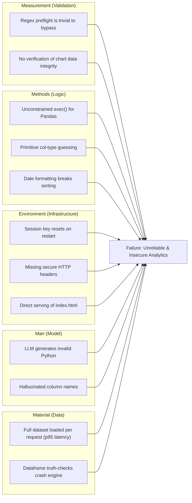

# Implementation Plan: Bulletproof Shipment QnA Bot (Hardening Phase)

This plan addresses critical security and functional gaps identified in the "BYOD" analytics flow and API core. Current implementation is highly vulnerable to Remote Code Execution (RCE) and identity spoofing.

## Fishbone Analysis: Failure to Deliver Secure & Reliable Analytics

## User Review Required

> [!CAUTION]
> **CRITICAL SECURITY RISK**: The current `pandas_engine.py` uses `exec()` with minimal regex protection. This allows any user to potentially execute arbitrary code on the server. I propose moving to a "constrained execution" model or pre-defined operation templates if full flexibility isn't required.

> [!WARNING]
> **IDENTITY SPOOFING**: The `scope.py` file currently falls back to trusting the payload if the user identity is missing. This will be removed to enforce "Deny-by-Default".

---

## Proposed Changes

### Core API & Security
- [x] [MODIFY] [main.py](file:///Users/m1air/Desktop/MCS_ChatBot/src/shipment_qna_bot/api/main.py)
- [x] Replace static `_APP_INSTANCE_ID` session key with a persistent env var.
- [x] Add `SecureMiddleware` (HTTPS redirect, HSTS).
- [x] Add `CORSMiddleware` with restricted origins.
- [x] Add security headers (CSP, X-Content-Type-Options, Frame protection).

- [x] [MODIFY] [scope.py](file:///Users/m1air/Desktop/MCS_ChatBot/src/shipment_qna_bot/security/scope.py)
- [x] Remove the "missing user identity" fallback that trusts the payload.
- [x] Enforce strict registry matching.

---

### Analytics & "BYOD" Engine
- [x] [MODIFY] [pandas_engine.py](file:///Users/m1air/Desktop/MCS_ChatBot/src/shipment_qna_bot/tools/pandas_engine.py)
- [x] Replace `exec()` with a safer execution strategy (e.g., using `ast.parse` and a whitelist-recursive-visitor or a restricted sandbox).
- [x] Add strict execution timeouts.
- [x] Improve error reporting for LLM-generated logic.

- [x] [MODIFY] [analytics_planner.py](file:///Users/m1air/Desktop/MCS_ChatBot/src/shipment_qna_bot/graph/nodes/analytics_planner.py)
- [x] Decouple chart generation from text response to ensure `chart_spec` is populated for bar/line requests.
- [x] Ensure date sorting happens on raw datetime objects, not formatted strings.
- [x] Improve chart-kind detection and categorical vs numeric heuristics.

- [x] [MODIFY] [intent.py](file:///Users/m1air/Desktop/MCS_ChatBot/src/shipment_qna_bot/graph/nodes/intent.py)
- [x] Fix Issue A: Prevent "praise/feedback" from being classified as `end` intent to stop session resets.

---

## Verification Plan

### Automated Tests
- [x] `pytest tests/test_pandas_flow.py`: Verify analytics still works after exec() hardening.
- [x] `pytest tests/test_rls.py`: Verify that missing identity now results in 403/Empty Access.
- [x] `pytest tests/test_hardening.py`: (New) Verify security headers and session persistence.

### Manual Verification
- [x] Request a "bar chart" and verify the `data.chart` payload is non-null.
- [x] Send "Great job!" and verify the session does NOT end.
- [x] Attempt to inject `__import__('os').system('ls')` in an analytics query and verify it is blocked.
